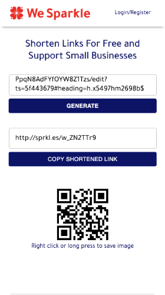
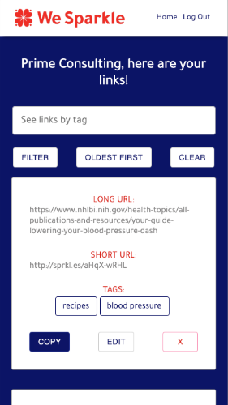
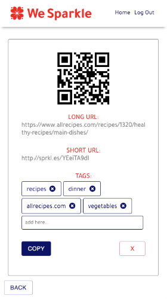

# Client Project - We Sparkle

_Duration: 3 weeks_

Say a user of WeSparkle's Sparkle Assistant would like to share a document with her customers.
The link is very long and confusing. She could go to a third party link shortener but WeSparkle now has their own that exists within the Sparkle Ecosystem.
Now she can create a short link and a QR code with less steps and less frustraion.

But anyone on the internet can use this link shortener. If they create an account, they will have access to advanced features. Each link shortened will saved. Links can i be tagged and sorted.
Also, metrics can be viewed. Clicks by Day, Top Performing Links, etc.

## Prerequisites

Before you get started, make sure you have the following software installed on your computer:

- [Node.js](https://nodejs.org/en/)
- [PostrgeSQL](https://www.postgresql.org/)
- [Nodemon](https://nodemon.io/)

## Screen Shots

### User View

## Installation

1. Create a database named `wesparkle_client`.
2. The queries in the `database.sql` file are set up to create all the necessary tables and populate the needed data to allow the application to run correctly. The project is built on [Postgres](https://www.postgresql.org/download/), so you will need to make sure to have that installed. We recommend using Postico to run those queries as that was used to create the queries. 
3. Open up your editor of choice and run an `npm install`
- Make sure you also have other dependencies installed (found in json file)
4. Run `npm run server` in your first terminal
5. Run `npm run client` in your second terminal
6. The `npm run client` command will open up a new browser tab for you!

## Usage

- Enter a link that is too long and would like to shorten into the first text field and 
- Click generate
- A much shorter link (beginning with http://sprkl.es/) will appear in the second text field
- A QR code also appears at the bottom of the screen
- When the short link is clicked, it will direct to the same location as the long link
- When the QR code is scanned it will direct to the same location as well
- If an account is created, the user will have access to advanced features
    - all shortened links will be saved and displayed
    - they can be sorted by creation date, starting with oldest or newest
    - tags can be added to any link and then be filtered for
    - when in a link's edit mode, the user can see metrics about that link (amount of clicks by day, etc.)

## Built With
- HTML
- CSS
- Javascript
- React
- Redux
- Redux-Saga
- Express
- Node.js
- PostgreSQL

## Acknowledgement
Thanks to our clients at WeSparkle, Michelle and Rachel. Thanks also to [Prime Digital Academy](www.primeacademy.io) who equipped and helped us to make this application a reality, as well as the members of our cohort, Paxos, for their support.

## Support
If you have suggestions or issues, please email us at [email@gmail.com](www.google.com)